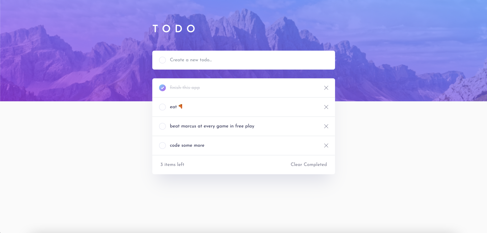

# todo
This is a simple todo app.

## Demo
[Live Demo](https://nc-todo.cyclic.cloud/)

## Built with
- Express
- Node
- Mongoose
- Passport.js
- TailwindCSS
- EJS

## Features
- [x] Sign in to create an account
- [x] Log in to view their todos
- [x] Add new todos to the list
- [x] Mark todos as complete
- [x] Mark completed todos as incomplete
- [x] Delete todos from the list
- [x] Clear all completed todos

## Running this Project Locally
From the repo:
1. Clone this project locally
2. Open the project in your preferred code editor
3. Open your terminal and `cd` to the project directory
4. Run `npm install` to install all relevant dependencies
5. Run `npm run dev` to start a dev server and view the project in your browser
